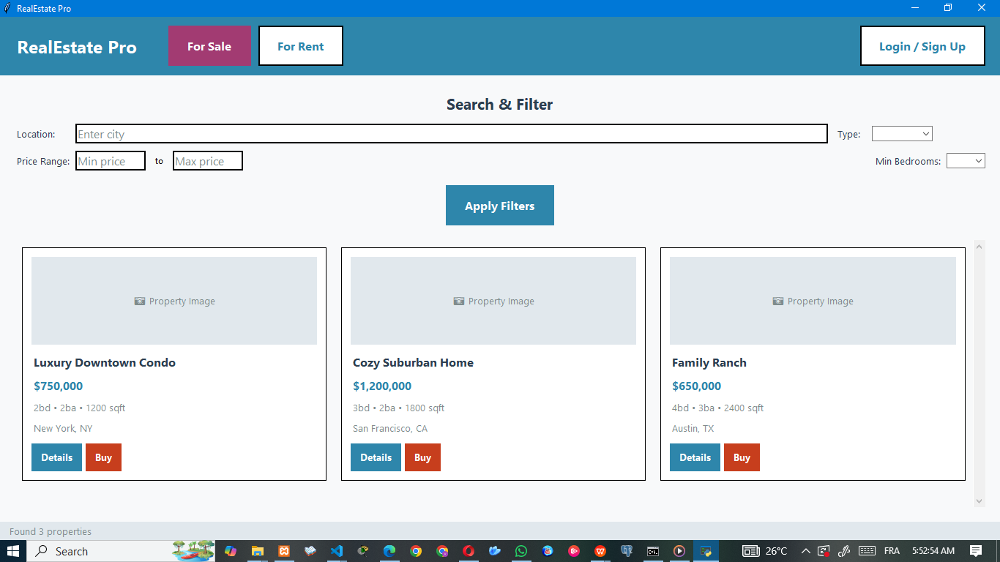
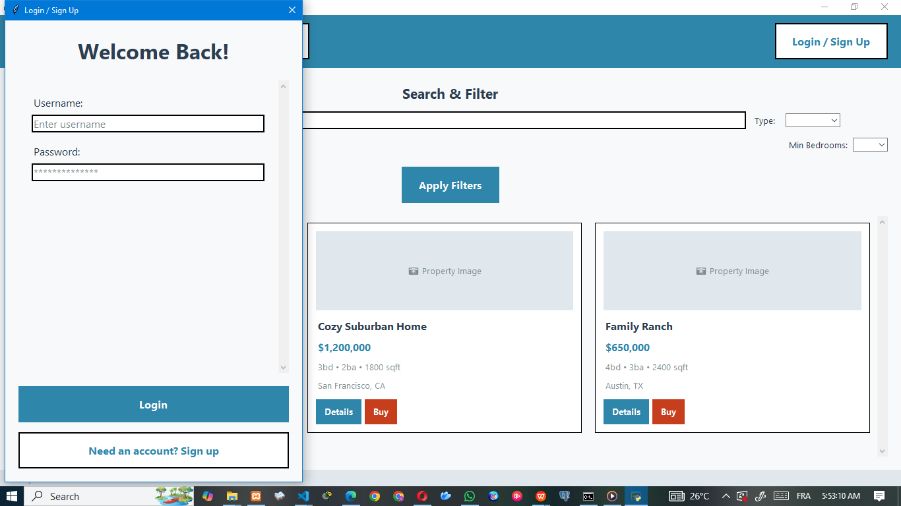
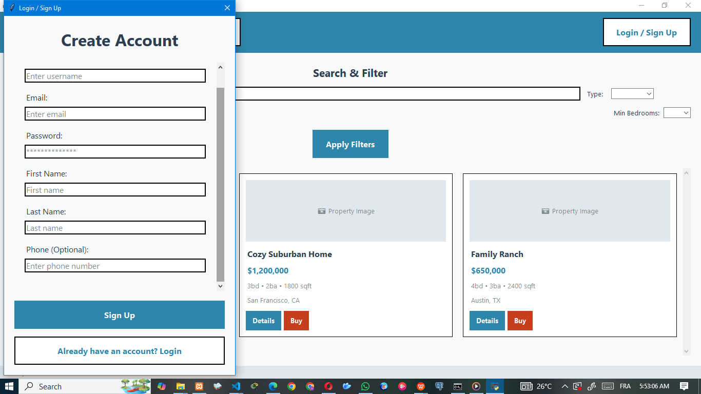
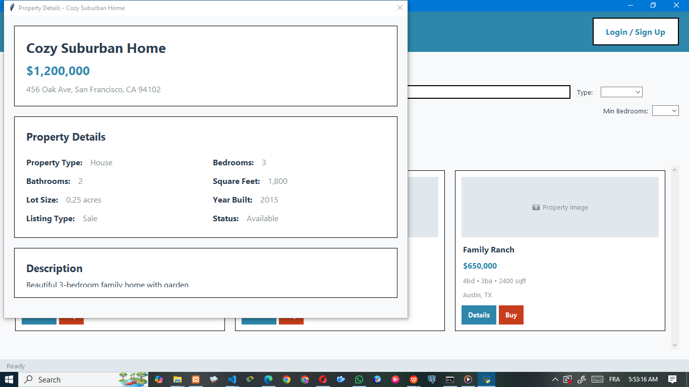
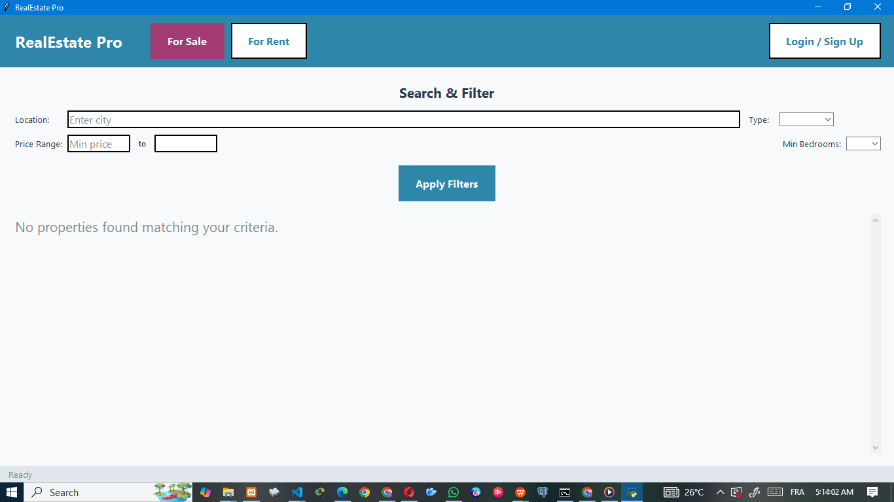

# RealEstate Pro

## Description

RealEstate Pro is a modern real estate management application built with Python and Tkinter. It allows users to browse, filter, and view property listings, as well as sign up, log in, and perform transactions such as purchasing or renting properties. The application uses a MySQL database for data storage and features a user-friendly interface with custom UI components.

## Technologies Used

- Python 3
- Tkinter (GUI)
- MySQL (Database)
- `mysql-connector-python` (Python MySQL driver)

## Project Structure

├── auth.py 
├── config.py 
├── database.py 
├── main.py 
├── property_details.py 
├── ui_components.py 
├── README.md 
└──pycache/
├── capture/ 
                ├── detailsProperty.png │ 
                ├── HomePage.png │ 
                ├── signIn.png │ 
                ├── singnUp.png │ 
                └── unvailablefilter.png 
                


## Requirements Installation

Make sure you have Python 3 installed and XAMPP or WAMP SERVER.  
Install the required Python package using pip:

```sh
pip install mysql-connector-python
```
## How To Run

1. Ensure your MySQL server is running and accessible.
2. Update the database credentials in config.py if needed.
3. Run the main application:

python [main.py](http://_vscodecontentref_/7)

# Screenshots
Collecting workspace information```markdown
# RealEstate Pro

## Description

RealEstate Pro is a modern real estate management application built with Python and Tkinter. It allows users to browse, filter, and view property listings, as well as sign up, log in, and perform transactions such as purchasing or renting properties. The application uses a MySQL database for data storage and features a user-friendly interface with custom UI components.

## Technologies Used

- Python 3
- Tkinter (GUI)
- MySQL (Database)
- `mysql-connector-python` (Python MySQL driver)

## Project Structure

```
.
├── auth.py # Handles for user authenticatio(login signup) UI and logic

├── config.py # Centralized configuration for app settings and database credentials

├── database.py # Database connection, schema creation, and all data access logic

├── main.py  # Main application entry point and core GUI logic

├── property_details.py # Window and logic for displaying detailed property information and actions

├── ui_components.py # Custom Tkinter UI widgets (buttons, entries, property cards, filters)

├── README.md # Project documentation and setup instructions
├── capture/  # Containing some users interfaces
│   ├── detailsProperty.png
│   ├── HomePage.png
│   ├── signIn.png
│   ├── singnUp.png
│   └── unvailablefilter.png
└── __pycache__/
```

## Collaborators

- [Victoire Luc Ngami](https://github.com/Lucky-On-13)  
- [Espoir Assounga](https://github.com/collaborator-github-username)

## Repository

Project GitHub repository: [https://github.com/Lucky-On-13/realestate-pro.git](https://github.com/Lucky-On-13/realestate-pro.git)

## How to Set Up from GitHub

1. **Clone the repository:**

```sh
git clone https://github.com/Lucky-On-13/realestate-pro.git
cd realestate-pro
```

## Requirements Installation

Make sure you have Python 3 installed.  
Install the required Python package using pip:

```sh
pip install mysql-connector-python
```

You also need to have a MySQL server running and update the credentials in [`config.py`](config.py) if necessary.


## How to Run

1. Ensure your MySQL server is running and accessible.
2. Update the database credentials in [`config.py`](config.py) if needed.
3. Run the main application:

```sh
python main.py
```


## Screenshots

### Home Page


### Sign In


### Sign Up


### Property Details


### Unavailable Filter

```

